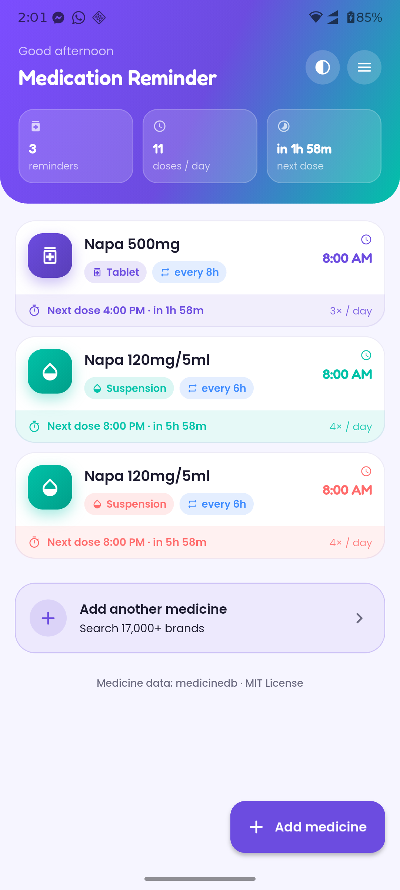
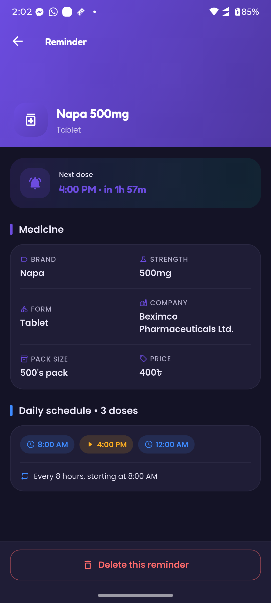
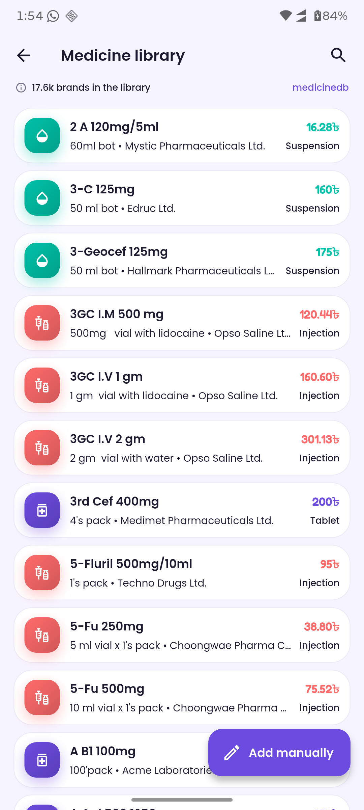
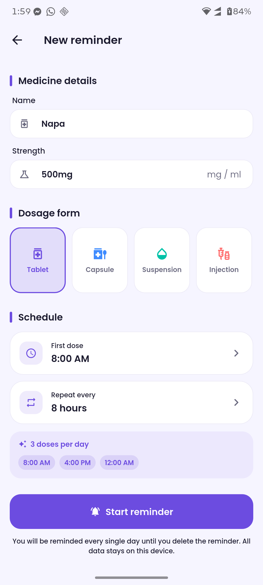
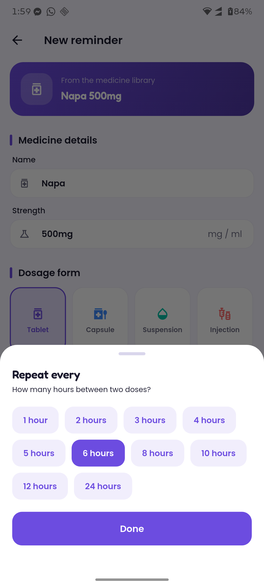
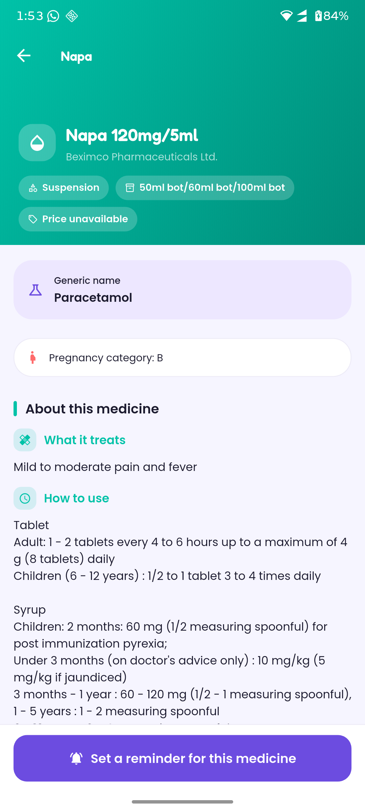
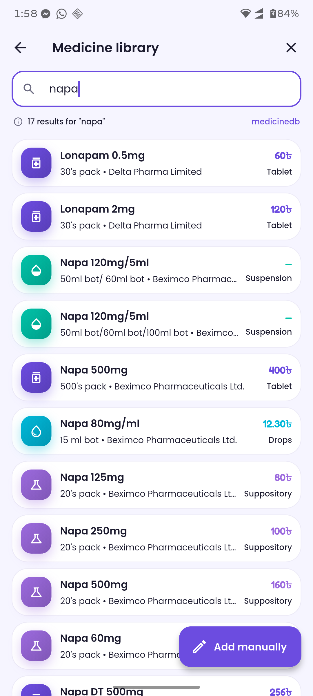
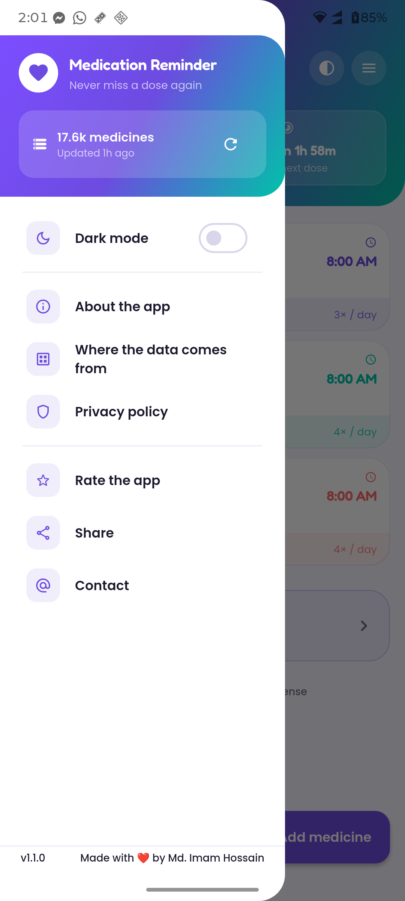
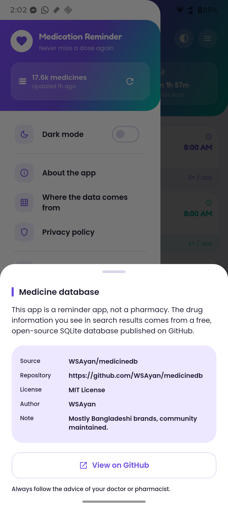
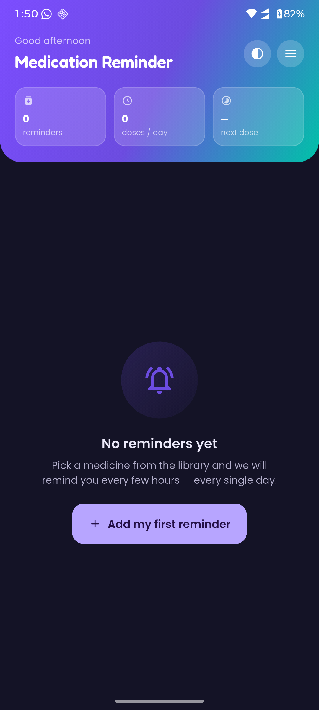

# 💊 Medication Reminder

A beautiful, **offline-first** Android app that reminds you to take your
medicines — and ships with a searchable database of **17 500+ medicine brands**
and **1 400+ generics** so you never have to type a medicine name by hand.

Built with Flutter. No account, no ads, no tracking: your reminders live only on
your phone.

[](https://flutter.dev)
[](https://dart.dev)
[](LICENSE)

---

## 📸 Screenshots

<table>
<tr>
<td width="33%"></td>
<td width="33%"></td>
<td width="33%"></td>
</tr>
<tr>
<td></td>
<td></td>
<td></td>
</tr>
<tr>
<td></td>
<td></td>
<td></td>
</tr>
<tr>
<td colspan="3"></td>
</tr>
</table>

---

## ✨ Features

- **🔍 Searchable medicine library** — instant, case-insensitive search across
  brand *and* generic names, with the manufacturer, pack size and price.
- **📖 Full drug monographs** — indication, dosage, side effects, precautions,
  contraindications, interactions, mode of action and pregnancy category, plus
  alternative brands of the same generic.
- **⏰ Interval reminders** — "every N hours" (1–24) starting from any time of
  day; the app schedules each individual dose with the OS alarm manager, so
  alarms survive a reboot and work while the phone is idle.
- **📅 Next-dose countdown** — the home screen always tells you what is due next
  and how long you have left.
- **🎨 Colour coded dosage forms** — every form (tablet, capsule, suspension,
  injection, drops, spray, cream…) has its own colour, icon and card accent.
- **🌗 Light & dark themes** with bundled Poppins + Fredoka fonts — no network
  request for typography.
- **✍️ Manual entry** for anything the database does not have.
- **🔌 Fully offline** after the first launch; the database lives in the app's
  private storage.
- **♻️ Self healing database** — the file is validated (SQLite header + schema)
  and swapped in atomically, and can be refreshed from the drawer.

---

## 💾 Where the medicine data comes from

> **The medicine information in this app is not created by this app.**

It is downloaded at runtime from a free, open-source SQLite database published
on GitHub:

| | |
|---|---|
| **Source** | [`github.com/WSAyan/medicinedb`](https://github.com/WSAyan/medicinedb) |
| **File** | [`medicine.db`](https://github.com/WSAyan/medicinedb/blob/main/medicine.db) |
| **Author** | [WSAyan](https://github.com/WSAyan) |
| **License** | MIT |
| **Contents** | ~17 500 brands · ~1 400 generics · ~650 manufacturers |
| **Coverage** | Mostly 🇧🇩 Bangladeshi brands, but it also covers most common generic medicines worldwide |
| **Tables** | `brand`, `generic`, `company_name`, `indication`, `pregnancy_category`, `systemic`, `therapitic`, `therapitic_generic`, `indication_generic_index` |

The original Firebase Storage URL this app used to pull the file from is no
longer reachable, so the downloader now resolves the file from the GitHub
repository. A copy of the database is kept in this repository under
[`db_backup/`](db_backup/) as a second line of defence — see
[`db_backup/README.md`](db_backup/README.md) for the full attribution and
refresh instructions.

The app shows this attribution in two places so it is never lost:

- the home screen footer,
- the drawer → **“Where the data comes from”**.

> ⚠️ **Disclaimer:** this is a reminder app, not a pharmacy. The drug
> information is community maintained and may be out of date. Always follow the
> advice of your doctor or pharmacist.

---

## 🐛 Fixes in this release

Compared to the previous version, this release fixes a number of real bugs:

| Area | What was wrong | What happens now |
|---|---|---|
| Database download | Pointed at a dead Firebase Storage bucket, and a failed download left the app stuck on a spinner forever | Fetches `medicine.db` from GitHub with two CDN fallbacks, validates the file, installs it atomically and shows a **Retry** button with the real error |
| Reminder scheduling | `time12to24Format()` produced `int.parse("0 ")` for every single‑digit start time, so **no reminder was ever scheduled** without throwing away the whole session | One robust parser handles `20:00`, `8:00 PM` and garbage input; covered by unit tests |
| Deleting a reminder | Compared notification id **lists** with `==`, which is identity in Dart, so the entry was rewritten instead of deleted and the alarms kept firing | Every reminder has a stable id; deletion cancels each alarm and removes the right record |
| Intervals like 5 h | `floor(24/5)` silently dropped a dose and could produce an hour > 23 | `buildSchedule()` wraps around midnight and only drops the incomplete tail |
| SQL injection | Search terms were interpolated straight into SQL, so an apostrophe broke the query | All queries use bound parameters with `LIKE` escaping |
| Infinite scrolling | `maxScrollExtent == pixels` (exact float compare) and no end-of-list guard | Threshold based on remaining scroll distance, with `hasMore` |
| Database handle | Copied the file over a database that was still open | The database is closed, replaced and reopened |
| Notifications | `flutter_local_notifications` was never initialised, and no `POST_NOTIFICATIONS` permission was requested | Initialised at startup, Android 13+ permission requested, re-scheduled on every launch |
| Theming | `ThemeData.light()` declared `brightness: Brightness.dark`, and the system-bar helper inverted light/dark | A proper Material 3 light + dark `ColorScheme`, correct system bar overlay |
| GetX usage | `GetView` pages never registered their controllers; `Obx` wrapped widgets that read no observable (red screen), and `Get.put()` ran inside `build()` | Controllers are owned by their `State`, observables are read inside the `Obx` scope |
| Android build | Gradle 6.7 / AGP 4.1 could not build with any modern Flutter | Migrated to the declarative Kotlin DSL, AGP 9, Gradle 9.1, `minSdk 23`, core library desugaring |
| App title | Showed up as **“Apk Extractor”** in the launcher | Shows up as “Medication Reminder” |

---

## 🏗️ Architecture

```
lib/
├── main.dart                       # bootstrap: storage → notifications → app
├── controllers/                    # GetX controllers (one per screen + bootstrap)
├── models/                         # Hive models + pure Dart value objects
├── services/                       # database, downloader, notifications, storage
├── theme/                          # Material 3 light/dark themes
├── ui/
│   ├── pages/                      # screens
│   ├── sheets/                     # time & interval pickers
│   └── widgets/                    # shared components
├── utils/                          # constants, time maths
└── ...

tool/generate_assets.py             # regenerates the launcher icon & splash art
db_backup/                          # offline copy of medicine.db + attribution
```

**Data flow**

```
Hive (reminders)  ──┐
                    ├──▶  HomeController  ──▶  HomePage
SQLite (medicine) ──┘         │
                              ├──▶  MedicineDbController  ──▶  MedicineDbPage
                              │            └──▶  MedicineDetailsPage
                              └──▶  ReminderFormController ──▶  NewReminderPage
                                                        │
                        NotificationService ◀──────────┘  (schedules / cancels alarms)
```

**The medicine database**

`lib/services/database_service.dart` opens `medicine.db` **read-only** and
exposes a small, typed query API (search, details, alternatives, counts).
`lib/services/database_downloader.dart` downloads the file, checks the SQLite
magic header, verifies the expected tables, then swaps it in with a single
`rename` so an interrupted download can never corrupt the installed copy.

**Reminders**

`lib/utils/time_utils.dart` holds all the scheduling maths: parsing (24h and
legacy 12h), building the daily dose list, finding the next dose and formatting
countdowns. It is the part of the app that is easiest to get wrong, so it is
covered by `test/logic_test.dart`.

---

## 🚀 Getting started

```bash
git clone https://github.com/imamhossain94/medication-reminder.git
cd medication-reminder

flutter pub get
flutter run                 # debug build on a connected device
```

### Tests

```bash
flutter test
```

### Build a release APK

```bash
flutter build apk --release      # build/app/outputs/flutter-apk/app-release.apk
flutter build appbundle          # for Google Play
```

> **Note on JDK:** this project uses AGP 9 / Gradle 9.1, so build with **JDK 17
> or newer** (e.g. Android Studio's bundled JBR).

### Regenerate the app icon

```bash
python tool/generate_assets.py
```

---

## 🔐 Privacy

- Reminders are stored in a local Hive box inside the app sandbox. They never
  leave the device — there is no backend, no analytics and no crash reporting.
- The app requests network access for exactly one thing: downloading
  `medicine.db` from GitHub (with CDN fallbacks). Nothing else is sent.
- `POST_NOTIFICATIONS` is requested so reminders can be delivered; alarms are
  scheduled with the OS alarm manager and restored after a reboot.
- No permissions for contacts, location, camera or storage are requested.

---

## 📄 License & credits

| | |
|---|---|
| App code | MIT — see [LICENSE](LICENSE) |
| Medicine data | MIT — [`WSAyan/medicinedb`](https://github.com/WSAyan/medicinedb) |
| Fonts | [Poppins](https://fonts.google.com/specimen/Poppins) & [Fredoka](https://fonts.google.com/specimen/Fredoka) — SIL Open Font License 1.1 |
| Developer & design | [Md. Imam Hossain](https://github.com/imamhossain94) |
